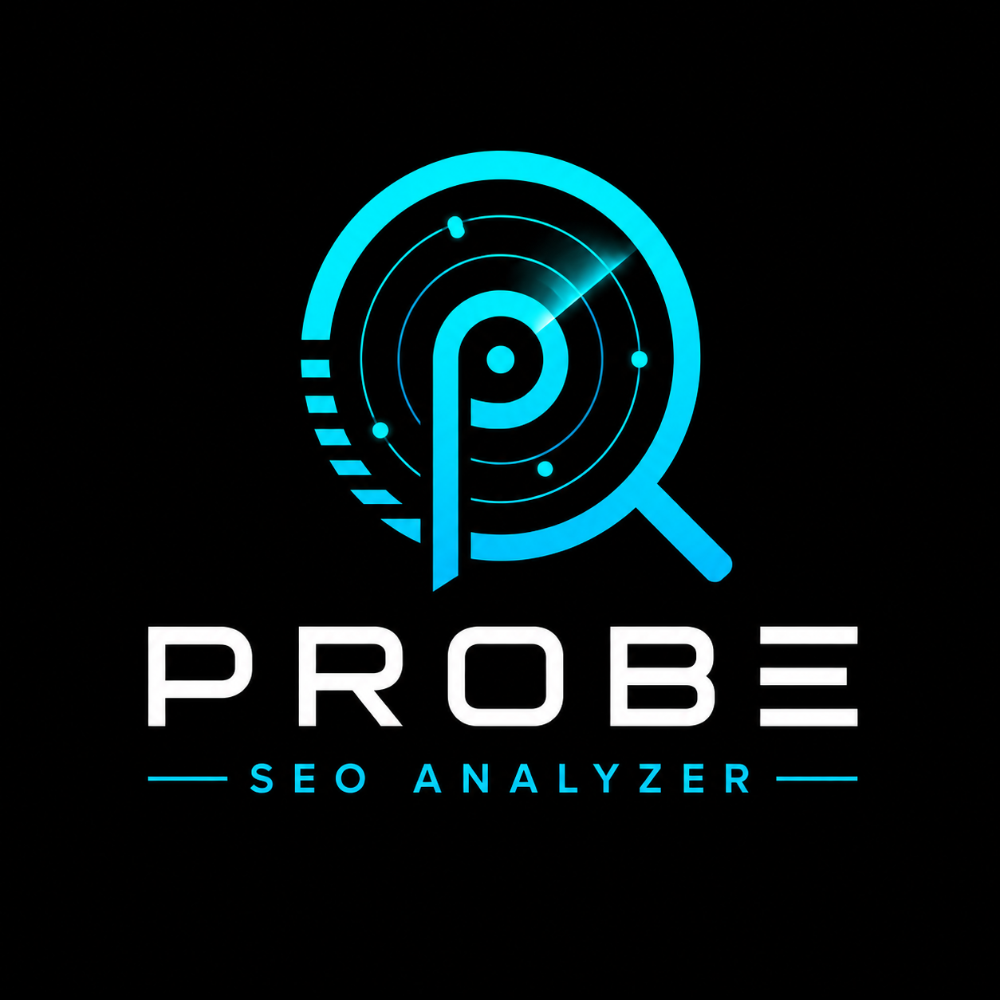
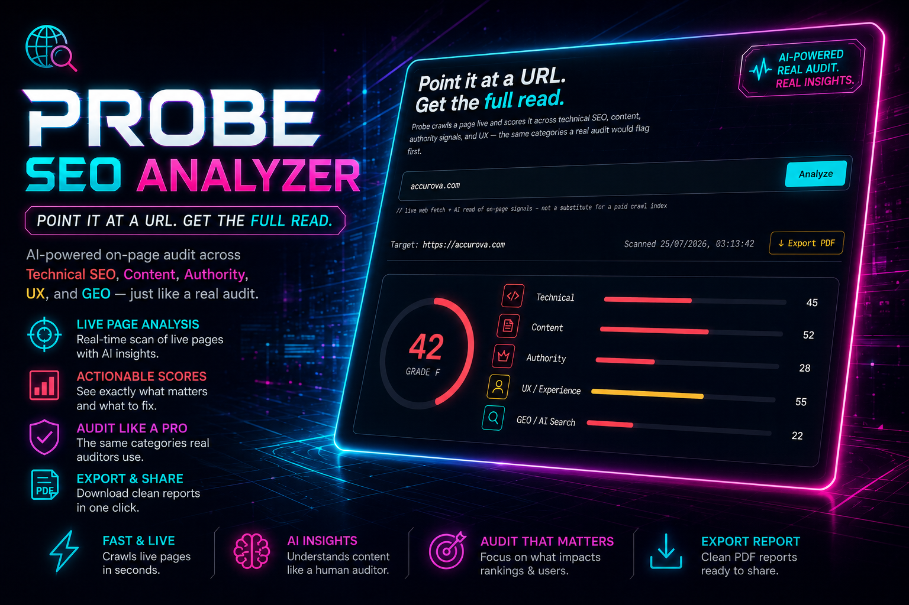

<div align="center">



# Probe — SEO & GEO Site Health Analyzer

**Point a URL at Probe and get an AI-powered audit covering SEO and AI-answer-engine readiness in seconds.**


</div>

---



## What it does

Probe is an SEO and Generative Engine Optimization (GEO) auditor for site owners and developers who want to know not just how search engines see their pages, but how AI answer engines (ChatGPT, Perplexity, Google AI Overviews, Claude) read and cite them. Submit a URL and the backend uses Claude with live web search to fetch the page and return a structured scorecard: an overall score, category breakdowns, meta/heading analysis, flagged issues, and prioritized actionables with estimated score impact. Results can be exported as a PDF client-side with no extra dependencies.

## How it works

- **Frontend** (`static/index.html`) — single-file HTML/CSS/JS, dark-premium UI.
  Posts the target URL to `/api/analyze` and renders the scorecard.
- **Backend** (`main.py`) — FastAPI. Holds the Anthropic API key server-side,
  calls Claude with the `web_search` tool to fetch and read the live page, and
  parses the structured JSON audit back to the frontend.
- **PDF export** — client-side via `window.print()` with a print stylesheet;
  no extra dependencies.

## Features

- **SEO + GEO audit in one request** — Technical, Content, Authority, UX, and GEO category scores, all in a single structured JSON response from Claude
- **GEO checks** — evaluates AI crawler access (`robots.txt` for GPTBot, ClaudeBot, PerplexityBot, Google-Extended, OAI-SearchBot), `llms.txt` presence, schema.org structured data, quotability of key facts, and author/entity clarity
- **Prioritized actionables** — 5–8 concrete fixes ranked by estimated score impact and effort level, spanning both SEO and GEO categories
- **AI Estimate transparency** — all AI-inferred figures (backlink tier, domain age, social presence) carry an `AI Estimate` badge so nothing is presented as measured fact
- **Optional Ahrefs integration** — set `AHREFS_API_KEY` server-side to swap AI estimates on Domain Rating and Ahrefs Rank for verified Ahrefs v3 data
- **Sample report demo** — landing page includes 3 instant, zero-cost example reports rendered client-side
- **PDF export** — client-side via `window.print()` with a print stylesheet; no server-side dependencies
- **Cost-controlled** — web search capped at 5 uses per audit; token and search count logged per request

## SEO vs. GEO

- **SEO checks** (Technical / Content / Authority / UX) — the classic search-engine
  factors: title/meta tags, heading structure, HTTPS, canonical tags, backlink
  signals, page structure.
- **GEO checks** (new) — how well the page is set up to be read, cited, and quoted
  by AI answer engines (ChatGPT, Perplexity, Google AI Overviews, Claude):
  whether AI crawlers (GPTBot, ClaudeBot, PerplexityBot, Google-Extended,
  OAI-SearchBot) are allowed in `robots.txt`, whether an `llms.txt` file exists,
  schema.org structured data coverage, whether key facts are stated clearly and
  quotably near the top of the page, and author/entity clarity.

## Estimated vs. verified data — important

Every number this app produces from the AI read (scores, backlink tier, domain
age, social presence, AI bot access, etc.) is a **best-effort AI estimate**,
not a measured figure from a crawled index. The UI always shows an
`AI Estimate` badge on these figures so it's never presented as fact.

There's a hook for real numbers: set `AHREFS_API_KEY` on the server (once
there's a paid Ahrefs plan behind it) and the backend will call Ahrefs' v3
Domain Rating endpoint (`GET /v3/site-explorer/domain-rating`) and swap the
badge to `Verified · Ahrefs`, showing real Domain Rating and Ahrefs Rank
alongside the still-AI-estimated fields (backlink tier, social presence,
content depth remain estimates — Ahrefs' full backlink/referring-domain data
needs additional Enterprise-tier endpoints not wired up here yet).

This is currently an all-or-nothing server-side flag, not a per-user paywall.
To turn it into an actual paid tier (e.g. "Pro" users get verified data, free
users get estimates), the natural next step is adding a billing provider
(Stripe is the common choice) and gating the `fetch_ahrefs_domain_rating` call
in `main.py` behind the requesting user's plan instead of a single global key.

## Tech Stack

| Layer | Choice |
|---|---|
| Backend | FastAPI + httpx |
| Frontend | Single-file HTML (dark-premium UI) |
| AI | Claude API (Anthropic), `web_search` tool |
| Hosting | Docker (Dockerfile + Procfile provided) |

## Quick Start

```bash
git clone https://github.com/TheBooleanJulian/probe-seo-analyzer
cd probe-seo-analyzer
pip install -r requirements.txt
cp .env.example .env
# Edit .env and add your ANTHROPIC_API_KEY
python main.py
```

Or with Docker:

```bash
docker build -t probe .
docker run -p 8000:8000 --env-file .env probe
```

Then open `http://localhost:8000`.

## Configuration

| Variable | Required | Default | Description |
|---|---|---|---|
| `ANTHROPIC_API_KEY` | Yes | — | Anthropic API key — used server-side to call Claude, never exposed to the client |
| `ANTHROPIC_MODEL` | No | `claude-haiku-4-5-20251001` | Claude model to use — override to test other models (e.g. switch to a Sonnet model for higher-quality audits) |
| `AHREFS_API_KEY` | No | — | Ahrefs v3 API key; when set, swaps AI estimates on Domain Rating / Ahrefs Rank for verified data |
| `PORT` | No | `8000` | Set automatically by Zeabur |

## Project Structure

```
probe-seo-analyzer/
|-- main.py               # FastAPI app + Anthropic/Ahrefs integration
|-- static/
|   `-- index.html        # Single-file HTML/CSS/JS frontend
|-- assets/
|   `-- hero.png          # README banner
|-- requirements.txt
|-- Dockerfile
|-- Procfile
|-- .env.example
`-- LICENSE
```

## Deploying on Zeabur

1. Push this repo to GitHub (see branching note below).
2. In Zeabur, create a new service from the GitHub repo — it will build from
   the included `Dockerfile` automatically (Procfile is included as a
   Nixpacks fallback if Docker build is skipped).
3. Add `ANTHROPIC_API_KEY` (and optionally `ANTHROPIC_MODEL`) as environment
   variables on the service.
4. Deploy. Zeabur assigns `PORT` automatically — the app already reads it.

## Branching workflow

Follows the standard `feature → dev → main` pattern:

- Build in `feature/*` branches.
- Merge into `dev` for integration testing against a Zeabur preview
  environment.
- Merge `dev` → `main` to deploy to production once verified.

## Notes on scope

Scores are AI-estimated from a live page read plus public web search signals —
this is not backed by a crawled backlink index (Ahrefs/Moz-grade authority
data isn't available without their paid APIs). Treat category/authority
numbers as directional, not exact.

## Status / Roadmap

**Done**

- [x] Full SEO + GEO audit via Claude with live web search
- [x] Structured JSON scorecard: scores, meta, technical checks, GEO checks, issues, actionables
- [x] Optional Ahrefs v3 Domain Rating integration (server-side flag)
- [x] Sample demo reports on landing page
- [x] PDF export via print stylesheet
- [x] Web search capped and per-request cost logging
- [x] JSON parse error diagnostics for production debugging
- [x] Dual AGPLv3 / Commercial license

**Paid credit-based subscription tier.** The Ahrefs hook described above is
currently all-or-nothing (one server-side key, everyone gets verified data or
nobody does). The plan is to turn this into an actual per-user paid tier,
modeled loosely on Ahrefs' own plan structure as a reference point for feature
gating and credit metering:

| | Free (current) | Future paid tier |
|---|---|---|
| Authority/backlink data | AI estimate only | Verified Ahrefs Domain Rating + Rank |
| Audits | Unmetered | Credit-metered (crawl credits per audit, like Ahrefs' 100k/500k/1.5M tiers) |
| Projects / saved sites | None | Tracked projects with historical score trend |
| Users per account | 1 | Seat add-ons (Ahrefs charges $40-80/mo per extra seat depending on tier) |

Ahrefs' own plans (Lite $129/mo, Standard $249/mo, Advanced $449/mo, billed
annually) bundle a feature ladder worth mining for ideas as this grows:

- **Lite-equivalent**: Site Explorer basics, Keywords Explorer, Site Audit,
  Rank Tracker, API access — roughly what Probe's single-audit flow already
  covers with AI estimates.
- **Standard-equivalent**: Portfolios (track multiple sites), Content
  Explorer, Batch Analysis, SERP comparison, deeper Site Explorer (broken
  backlinks/links, site structure), Keywords Explorer AI suggestions/clusters.
- **Advanced-equivalent**: Looker Studio / reporting integrations, search
  type distribution, site segmentation, HTTP-auth site audits — enterprise
  reporting features, lowest priority for this project's scale.

Next concrete step: add a billing provider (Stripe is the common choice) and
gate `fetch_ahrefs_domain_rating` in `main.py` behind the requesting user's
plan/credit balance instead of a single global `AHREFS_API_KEY`.

**Other planned features / open suggestions:**

- **Per-user gating of Ahrefs verified data** behind the billing plan above,
  rather than a single global server flag — hook is already in `main.py`,
  needs a billing provider wired in.
- **Ahrefs Enterprise-tier endpoints** for full backlink/referring-domain data
  (backlink tier, social presence, content depth remain AI estimates even
  when `AHREFS_API_KEY` is set).
- **Rate limiting & abuse protection.** `/api/analyze` is currently public
  and unauthenticated — every request costs real Anthropic API spend. Before
  any wider traffic, add per-IP rate limiting (e.g. `slowapi`) and/or a
  simple CAPTCHA on repeated hits, so the cost surface isn't wide open.
- **Result caching.** Cache the parsed audit per normalized URL for a short
  TTL (e.g. 6–24h) so re-analyzing the same site — a likely pattern once
  people start sharing/bookmarking reports — doesn't re-spend an API call.
- **Persistent report history + shareable links.** Store completed audits
  (Postgres/SQLite) and give each one a permalink (`/r/<id>`), instead of
  PDF export being the only way to keep or share a result.
- **Scheduled re-audits / monitoring mode.** Let a user "watch" a URL and
  get a weekly re-scan with a diff (score changes, new/resolved issues) —
  turns Probe from a one-shot tool into a monitoring product, and pairs
  naturally with the paid tier's "projects" concept above.
- **Multi-page / site-wide audits.** Currently one URL per audit; crawling
  a handful of key pages (home, top nav links) and rolling them into one
  site-level score would catch issues a single-page read misses.
- **Competitor comparison view.** Run two URLs side by side and diff their
  scores/checks — useful for the "how do I compare to X" pitch that's
  common in SEO tooling.
- **Real server-side page fetch for on-page checks.** Meta/heading/technical
  checks currently rely on Claude's `web_search` read of the page rather
  than a direct server-side HTTP fetch + HTML parse. Fetching the page
  directly (`httpx` + `BeautifulSoup`/`selectolax`) would make on-page
  checks fully verified instead of best-effort, and is cheaper than routing
  them through the model.
- **Export/integration options beyond PDF.** CSV/JSON export of the
  actionables list, and optionally a Slack/webhook notification when a
  scheduled re-audit finds a regression.
- **Tests.** No test files currently exist — at least a JSON parse and URL
  normalisation unit test would protect the audit pipeline from regressions.
- **CI.** No CI config detected — a GitHub Actions workflow for lint/test on
  PR would close the gap given the public repo.

## Changelog

Versioned using [semver](https://semver.org/) (`major.minor.patch`) — major for
breaking/legal changes, minor for new features, patch for fixes. Matches the
`version` set on the FastAPI app in `main.py`.

### v1.3.0 — 2026-07-25
- **Added**: Third sample report on the landing page (`bnicrescendo.sg`) —
  extracted from a real audit PDF, joining `thebooleanjulian.dev` and
  `accurova.com` as instant, zero-cost example reports.
- **Added**: Page title and "Built by TheBooleanJulian" byline to the
  landing page and README.

### v1.2.0 — 2026-07-25
- **Changed**: Relicensed from MIT to dual AGPLv3 / Commercial license (see
  [License](#license)) — a major-relevant change to the terms under which the
  code is available, tracked here even though the app's runtime behavior is
  unchanged.
- **Docs**: Expanded the roadmap with additional planned features.

### v1.1.0 — 2026-07-25
- **Added**: Sample report demo on the landing page (`thebooleanjulian.dev`,
  `accurova.com`) — instant, zero-cost example reports rendered client-side.
- **Fixed**: `/api/analyze` returned a generic parse error when the model's
  JSON response was truncated; raised `max_tokens` from 1500 → 4096 to stop
  truncation on larger audits.
- **Fixed**: Added diagnostics (`stop_reason`, response length, failure
  snippet) to JSON parse errors so future failures are debuggable from the
  error message alone.
- **Changed**: Capped the `web_search` tool to `max_uses: 5` and added
  per-request token/search-count logging, after an unindexed domain caused
  the model to run ~20 searches (~$0.20) chasing content it couldn't find.

### v1.0.0 — 2026-07-24
- Initial release: live-read SEO + GEO audit engine (FastAPI backend proxying
  Claude with the `web_search` tool), single-file dark-UI frontend, PDF
  export via print stylesheet, optional Ahrefs Domain Rating verification
  hook, MIT license.

## License

Dual-licensed: **AGPLv3** for open-source use and **Commercial** for proprietary/SaaS deployments. See [`LICENSE`](LICENSE), [`COMMERCIAL-LICENSE.md`](COMMERCIAL-LICENSE.md), and [`NOTICE`](NOTICE) for terms. Trademark policy in [`TRADEMARKS.md`](TRADEMARKS.md).

---

<div align="center">
<sub>Built by <a href="https://github.com/TheBooleanJulian">@TheBooleanJulian</a></sub>
</div>
